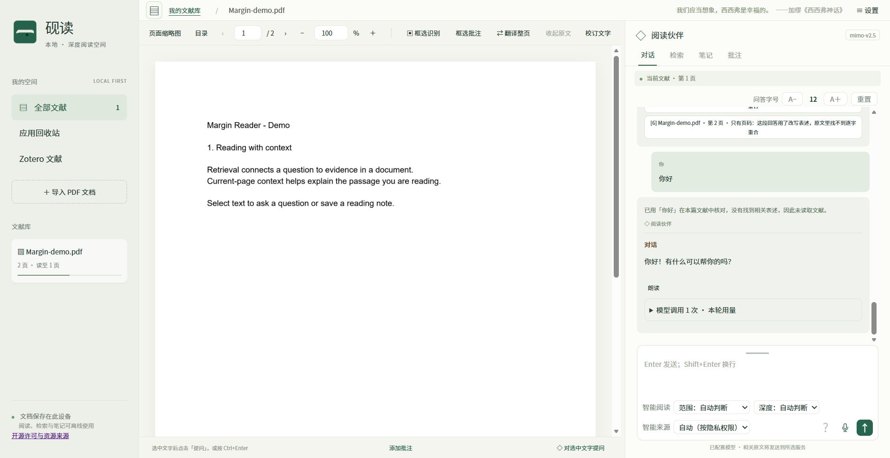

#  勘读 · KanRead

**面向人文社科研究的一站式文献工作台。** 读文献、翻译、批注、笔记、检索都在同一个窗口里完成，数据留在本机。

现在的 AI 工具大多只解决"问一句、答一句"。但真正做研究要的是另一件事：**读完一篇文献的完整链路**——读懂它、把关键处译过来、标出批注、记下笔记，然后在你积累的全部文献里检索。勘读把这五件事放在一起，并且坚持一条底线：**说不清出处的结论，宁可不说。**

## 它解决什么问题

通用的 AI 问答读论文有三个老毛病：**编造**（说得像原文里有，其实没有）、**丢来源**（给一段结论但不知道出自哪一页）、**读不完**（长篇文献放不进一次请求，读完也不告诉你读了多少）。

勘读针对这三点：

- **每句结论对得上原文**：回答生成后会**逐段核对**是否有原文依据，缺证的段落标为「待核对」而不是冒充结论；引用分三档如实区分——逐字核验的摘引、仅用于定位的锚点、只有页码。
- **引用能跳回那一行**：点引用编号跳到对应页并高亮那句话，不是只给个"第 7 页"。
- **长文献如实处理**：装得下就一次读完，装不下就连续分批读完并**如实报告读到哪、还剩哪些页**；报告里有覆盖台账，说明这一轮检查了哪些方面、哪些只是"这批原文里没见到"。
- **数据不出本机**：文献、批注、笔记、译文都存在本地 SQLite；全文索引、稀疏向量、重排、OCR 全在本机跑。只有你配置的模型服务会收到相应内容，界面逐项写明发送范围。

## 怎么用

1. **装一次**： **`安装 Python 3.11+`** ， **`双击start.bat`** 安装依赖；之后双击项目根目录的 **`勘读.exe`** 启动（它会等后台就绪，再用本机 Edge 打开窗口）。关闭窗口后本地服务会自行退出。
2. **导入文献**：「＋ 导入 PDF 文档」。原文件按原始字节保存，只渲染与索引，不改写文献、不替换文献字体。
3. **配置模型**（可选）：设置 →「模型服务」添加平台与 API Key，再在「会话模型 / Embedding / Rerank」里选用。**不配也能用**——本机检索、TF-IDF 向量、重排和 OCR 都可用，只是解释与总结需要模型。
4. **提问**：选中原文后点「对选中文字提问」（或 Ctrl+Enter），也可以直接提问。范围由问题与选文自动决定，不需要手动切换精读 / 泛读。
5. **读结果**：答案带引用编号，点编号跳回原文；展开报告可看逐段核对结果与覆盖台账。
6. **翻译**：工具栏「⇄ 翻译整页」在右侧开译文栏——原文页与译文并排，逐段对应；也可以只翻选中的一段，或在工作台一键发起整篇后台翻译。译文逐段存在本机、可随时修改或换服务重译。翻译服务在「设置 → 翻译」里配置。
7. **批注与笔记**：选中文字可高亮、下划线、写批注；**批注锚点始终落在原文上**——在译文里选文字加批注时，本机会反查回对应原文，译文侧按句级对齐画出同样的标记。笔记按页或整篇记录，随文献保存在本机，可导出 Markdown。
8. **检索**：在已导入的全部文献里做全文检索，命中后可跳回原文那一页；配置了 Embedding 服务时还会做语义检索，译文也能被搜到。
9. **联网搜索**（可选）：默认关闭，在「设置 → 联网搜索」里开启；搜索主题默认逐次确认。

## 核心能力

- **按问题确定范围的阅读**：需要全文时完整读取；容量只决定"一次读完"还是"连续分批读完"，不改变覆盖口径。
- **证据银行**：分批读完后，每一批逐字核验过的摘引由本机原样保留，只有派生分析参与压缩——**压缩不会吞掉已核验的原文**。
- **范围由正文复核**：局部提问时先用问题术语在已索引全文里核对一遍，把"计划之外但正文确实在谈"的页补进来；读完再做缺口检索，命中未读页就补读。没查全时会明确说"这次没有查全"。
- **逐段可核对**：报告列出每段的支持依据与逐字摘引，也能直接看到哪些段落没有通过核对。

## 数据与隐私

- 文档与数据库在 `data/`，**不纳入版本控制**，可用 `READER_DATA_DIR` 改位置；备份时停服务后复制整个目录。
- Windows 上 API Key 用当前用户的 DPAPI 加密，网页只获知"是否存在密钥"，不回传明文。
- 远程模型会收到：你的问题、选区、相关原文与最近对话（会话模型）；待索引的文档文字（Embedding）；问题与召回片段（Rerank）。界面逐项说明。
- 联网搜索**默认关闭**，只在「设置 → 联网搜索」里手动开启；开启后"追加搜索"与"读取公开网页正文"是两项独立授权，不会一并打开。

## 许可

- 代码采用 **PolyForm Noncommercial 1.0.0**（见 [`LICENSE`](LICENSE) 与 [`NOTICE`](NOTICE)）。
- 名称与图标不在代码许可证授权范围内，使用边界见 [`legal/BRAND.md`](legal/BRAND.md)。
- 第三方组件与资源的授权状况见 [`legal/THIRD-PARTY.md`](legal/THIRD-PARTY.md)；字体适用 SIL OFL 1.1，全文见 [`static/fonts/OFL.txt`](static/fonts/OFL.txt)。
